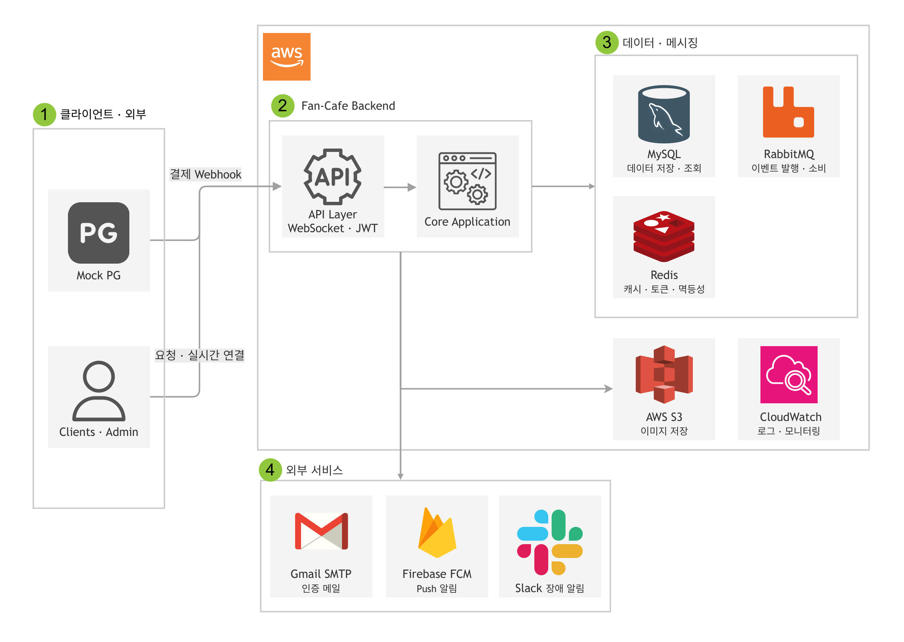
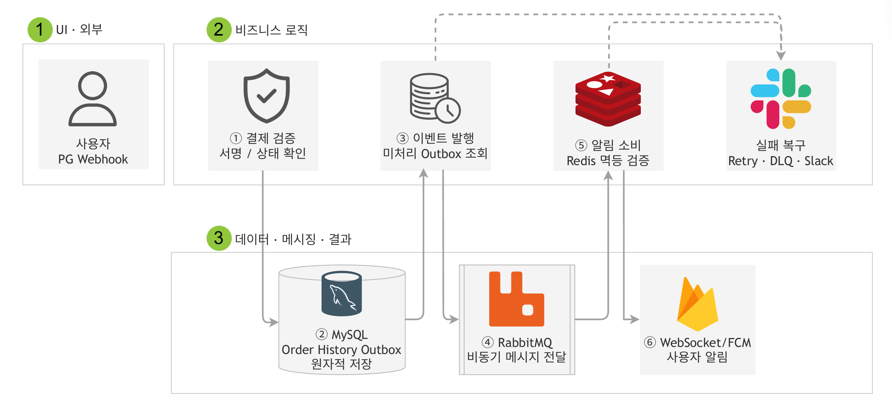

# Fan-Cafe

굿즈 주문이 집중되는 환경에서 재고 동시성, 결제 중복 처리와 후속 이벤트 유실 문제를 다루는 Spring Boot 백엔드 프로젝트입니다. 
## 기술 스택 및 아키텍처


### 기술 스택

| 구분 | 기술 / 버전 | 도입 목적                             |
| --- | --- |-----------------------------------|
| Language / Framework | Java 21, Spring Boot 3.5.13, Spring Data JPA, Spring Security | 도메인 로직, 트랜잭션, JWT 인증 구현           |
| Database / Cache | MySQL 8.0, Redis 7, QueryDSL 5.0.0 | 영속 데이터 저장, 멱등성 조회 부하 완화, 동적 조회 구현 |
| Messaging | RabbitMQ 3 (`rabbitmq:3-management`), Spring AMQP | 결제 후 알림 분리, 지연 재시도 및 DLQ 구성       |
| Infra / Monitoring | Docker Compose 3.9, AWS S3, CloudWatch Logs, Actuator, Slack | 실행 환경 구성, 파일 저장, 상태 감지 및 장애 알림    |
| Test / Tools | JUnit 5, Mockito, k6 | 단위, 통합 테스트와 Webhook, Outbox 부하 측정 |

### 아키텍처 및 주문·결제 처리 흐름

#### 전체 시스템 아키텍처

<p align="center">
  
</p>

#### Transactional Outbox 기반 결제 이벤트 처리 흐름

<p align="center">
  
</p>

주문 시 재고를 안전하게 확보한 후 결제 검증을 합니다. 
주문 상태와 알림 이벤트를 함께 저장한 뒤 RabbitMQ를 통해 중복 없이 사용자 알림을 전달합니다.

## 핵심 기술적 문제 해결

### 1. Transactional Outbox를 통한 이벤트 유실 방지

**Problem:** DB 커밋과 MQ 발행 사이에 서버가 중단되면 결제 상태만 반영되고 알림 이벤트가 유실될 수 있었습니다. 알림을 동기 처리하면 RabbitMQ 지연과 장애가 결제 응답에 영향을 미칩니다.

**Cause:** MySQL 트랜잭션과 RabbitMQ 발행 시, 주문 상태 변경과 외부 메시지 발행 사이에 부분 실패 구간이 존재했습니다.

**Fix:** 결제 승인, 상태 이력, `OutboxEvent` 저장을 하나의 DB 트랜잭션으로 묶고, 커밋된 이벤트 발행은 별도 Poller로 분리했습니다. 이벤트 상태는 `NEW`, `SENT`, `FAILED`, `MANUAL_REQUIRED`로 관리합니다.

**Result:** 결제 정합성 및 Outbox 발행 실패 통합 테스트의 10개 시나리오에서 중복 Webhook, 동시 요청, 금액 불일치, 서명, 시간 검증 실패, MQ 발행 실패에 따른 중복 반영과 유실 되지 않음을 검증했습니다.

<details>
<summary>관련 코드 및 파일</summary>

- [`OrderPaymentCommandService.java`](src/main/java/com/example/fan_cafe/order/application/OrderPaymentCommandService.java): 결제 상태, 상태 이력, Outbox를 하나의 트랜잭션에서 변경합니다.
- [`OutboxEvent.java`](src/main/java/com/example/fan_cafe/outbox/domain/OutboxEvent.java): 이벤트 상태와 발행 재시도 정보를 관리합니다.

```java
lockedOrder.markPaid(paymentKey);
recordStatusHistory(lockedOrder, from, Status.PAID, historyReason);
persistOutboxWithEventId(
        OutboxEvent.init("ORDER", lockedOrder.getId(), buildOrderPaidPayload(lockedOrder))
);
```

</details>

### 2. Outbox Poller 조회 병목 개선

**Problem:** Outbox 이벤트 누적 시 처리 대상 조회 p95가 3초까지 증가했습니다. Polling 주기를 늘리면 DB 부하는 줄지만 이벤트 전달이 지연되고, 다중 Poller는 잠금 대기가 발생할 수 있습니다.

**Cause:** `status`, `next_retry_at` 조건의 반복 필터링과 `id` 정렬 비용이 증가했으며, 여러 Poller가 같은 행을 처리 대상으로 선택할 수 있었습니다.

**Fix:** 조회 조건 순서에 맞춘 `(status, next_retry_at, id)` 복합 인덱스와 `LIMIT 50`, `FOR UPDATE SKIP LOCKED`를 적용했습니다.

**Result:** Poller 조회 p95는 3초에서 70.04ms로 감소했고 API p95는 19.2% 개선됐습니다.

<details>
<summary>관련 코드 및 파일</summary>

- [`OutboxEvent.java`](src/main/java/com/example/fan_cafe/outbox/domain/OutboxEvent.java): `status`, `next_retry_at`, `id` 순서의 복합 인덱스를 정의합니다.
- [`OutboxEventRepository.java`](src/main/java/com/example/fan_cafe/outbox/infrastructure/OutboxEventRepository.java): 처리 대상 50건을 `FOR UPDATE SKIP LOCKED`로 조회합니다.

```sql
SELECT *
FROM outbox_events
WHERE status IN ('NEW', 'FAILED')
  AND next_retry_at <= :now
ORDER BY id
LIMIT 50
FOR UPDATE SKIP LOCKED;
```

</details>

### 3. 실패 이벤트 재시도 및 수동 복구

**Problem:** 일시적 장애는 재시도로 복구할 가치가 있지만 반복 실패 이벤트는 빠르게 제외해야 합니다. 로그만으로는 재시도 대기, 한도 초과, 수동 처리 대상을 구분하기 어렵습니다.

**Cause:** 실패 유형별 상태와 재시도 정책, 한도 초과 이벤트를 정상 처리 흐름에서 분리하는 경로가 필요했습니다.

**Fix:** Poller에 지수 Backoff와 Jitter를 적용하고 `retry_count`, `next_retry_at`, `last_error`를 기록합니다. 발행 한도 초과는 `MANUAL_REQUIRED`, Consumer 처리 한도 초과는 DLQ로 분리하고 관리자 재처리, Trace ID 로그, Slack 알림과 HealthIndicator를 연결했습니다.

**Result:** 일시적 발행 실패는 자동 재시도로 복구하고, 재시도 한도를 초과한 이벤트는 `MANUAL_REQUIRED` 또는 DLQ로 격리했습니다. 장애 감지 시 Slack 알림이 전송되고, 관리자가 격리된 이벤트를 재처리하는 흐름을 테스트했습니다.

<details>
<summary>관련 코드 및 파일</summary>

- [`OutboxPoller.java`](src/main/java/com/example/fan_cafe/outbox/application/OutboxPoller.java): 발행 실패 상태, 다음 재시도 시각과 수동 처리 상태를 기록합니다.
- [`DlqService.java`](src/main/java/com/example/fan_cafe/outbox/application/DlqService.java): DLQ 이력을 저장하고 재시도 소진 이벤트를 Main Queue로 재발행합니다.

</details>

## 실행 및 부하 테스트

<details>
<summary>환경 변수</summary>

```env
SPRING_PROFILES_ACTIVE=dev
MOCK_PG_WEBHOOK_SECRET=

DB_URL=
DB_USERNAME=
DB_PASSWORD=

REDIS_HOST=
REDIS_PORT=

RABBITMQ_HOST=
RABBITMQ_PORT=
RABBITMQ_USERNAME=
RABBITMQ_PASSWORD=

AWS_REGION=
AWS_S3_BUCKET=
MAIL_PORT=
SERVER_PORT=

ACTUATOR_USER=
ACTUATOR_PASSWORD=
```

JWT RSA 키, Firebase 서비스 계정 파일, AWS S3 접근 권한이 추가로 필요합니다. 비밀값은 저장소에 커밋하지 않습니다.

</details>

Docker Compose 실행:

```bash
docker compose up -d --build
```

### k6 부하 테스트

부하 테스트 전에 DB 프로시저 파일 `scripts/seed-payment-pending-orders.sql`을 실행해 `PAYMENT_PENDING` 주문 100,000건을 생성합니다.

```bash
mysql -u root -p fan_cafe < scripts/seed-payment-pending-orders.sql
```

```bash
k6 run -e BASE_URL=http://localhost:8080 -e MOCK_PG_WEBHOOK_SECRET=<MOCK_PG_WEBHOOK_SECRET> k6/order-webhook-outbox-load-test.js
```
