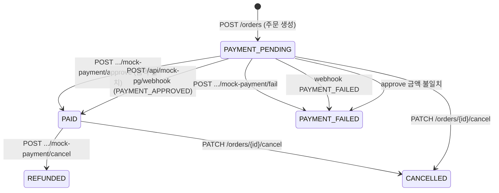

# Fan-Cafe Backend

## Mock 결제 상태 전이 (포트폴리오용)

실제 PG 연동 없이, 주문 생성 → Mock PG 승인/실패 → `PAID` 전이 후 **Transactional Outbox** 알림이 이어지는 흐름을 얇게 보완한 구간입니다.

### 상태 전이 다이어그램



| 전이 | Outbox `ORDER_CREATED` | `order_status_history` |
|------|------------------------|-------------------------|
| 생성 → `PAYMENT_PENDING` | 저장 안 함 | 저장 안 함 |
| 승인 → `PAID` | **저장** (주문 상태와 동일 트랜잭션) | 저장 |
| 실패 / 금액 불일치 → `PAYMENT_FAILED` | 저장 안 함 | 저장 |
| 동일 키로 재승인 (`PAID` + 같은 key) | 저장 안 함 | 저장 안 함 |
| Mock 취소/환불 (`PAID` → `REFUNDED`) | **PAYMENT_REFUNDED** 저장 | 저장 |
| 동일 키로 재취소 (`REFUNDED` + 같은 key) | 저장 안 함 | 저장 안 함 |

### API 예시

기본 주문 API는 `POST /orders`, Mock 결제는 `POST /api/orders/...` 입니다.  
모든 요청에 JWT(`Authorization: Bearer <token>`)가 필요합니다 (local/dev 프로필).

#### 1) 주문 생성 → `PAYMENT_PENDING`

```http
POST http://localhost:8080/orders
Authorization: Bearer <access_token>
Content-Type: application/json

{
  "items": [
    { "productId": 1, "quantity": 2 }
  ]
}
```

응답 예: `status` = `PAYMENT_PENDING`, Outbox 미저장.

#### 2) Mock PG 승인 → `PAID` + Outbox

```http
POST http://localhost:8080/api/orders/{orderId}/mock-payment/approve
Authorization: Bearer <access_token>
Content-Type: application/json

{
  "approvalAmount": 20000,
  "idempotencyKey": "mock-pay-20260521-001"
}
```

- `approvalAmount`는 주문 `totalPrice`와 **반드시 일치**해야 합니다.
- `idempotencyKey` 또는 `mockPaymentKey` 중 하나는 필수입니다.
- 이미 `PAID`이고 **같은 키**면 200 응답만 반환 (Outbox·이력 중복 없음).
- 금액 불일치 시 `PAYMENT_FAILED`로 바뀐 뒤 `O008` 예외.

#### 3) Mock PG 실패 → `PAYMENT_FAILED`

```http
POST http://localhost:8080/api/orders/{orderId}/mock-payment/fail
Authorization: Bearer <access_token>
Content-Type: application/json

{
  "reason": "user cancelled mock checkout"
}
```

Outbox는 저장하지 않습니다.

#### 4) Mock PG 전체 취소/환불 → `REFUNDED` + Outbox

`PATCH /orders/{id}/cancel`(→ `CANCELLED`, `ORDER_CANCELLED`)과 별도로, **결제 완료 후 Mock PG 환불** 전용 API입니다.

```http
POST http://localhost:8080/api/orders/{orderId}/mock-payment/cancel
Authorization: Bearer <access_token>
Content-Type: application/json

{
  "cancelReason": "고객 변심",
  "idempotencyKey": "mock-refund-20260521-001"
}
```

| 조건 | 동작 |
|------|------|
| 주문 상태 `PAID` | `REFUNDED`로 변경 + 재고 복구 + `PAYMENT_REFUNDED` Outbox |
| 동일 `idempotencyKey`로 재요청 (`REFUNDED`/`CANCELLED` + 키 일치) | 멱등 응답, Outbox·이력 추가 없음 |
| 다른 `idempotencyKey`로 재요청 (이미 환불/취소됨) | `O017` 예외 |
| `PAYMENT_PENDING` / `PAYMENT_FAILED` | `O016` 예외, Outbox 없음 |

#### 5) Mock PG 웹훅 (서버 푸시형)

JWT 없이 **HMAC-SHA256** 서명만 통과하면 처리합니다.  
설정: `mock.pg.webhook-secret` (`application.properties` / `application-local.properties`)

| 헤더 | 설명 |
|------|------|
| `X-Mock-PG-Timestamp` | Unix epoch **초** (문자열) |
| `X-Mock-PG-Signature` | `HMAC-SHA256(secret, timestamp + "." + rawBody)` 의 **소문자 hex** |

서명 실패·타임스탬프 5분 초과 시 **주문 상태·Outbox 변경 없음**.

**PAYMENT_APPROVED** 본문 예:

```json
{
  "eventType": "PAYMENT_APPROVED",
  "orderId": 10,
  "approvalAmount": 20000,
  "idempotencyKey": "wh-approve-001"
}
```

**PAYMENT_FAILED** 본문 예:

```json
{
  "eventType": "PAYMENT_FAILED",
  "orderId": 10,
  "reason": "card declined"
}
```

**curl 예시 (PowerShell에서 서명 생성 후 호출)**

```powershell
$secret = "local-mock-pg-webhook-secret"
$body = '{"eventType":"PAYMENT_APPROVED","orderId":10,"approvalAmount":20000,"idempotencyKey":"wh-001"}'
$ts = [int][double]::Parse((Get-Date -UFormat %s))
$hmac = New-Object System.Security.Cryptography.HMACSHA256
$hmac.Key = [Text.Encoding]::UTF8.GetBytes($secret)
$sigBytes = $hmac.ComputeHash([Text.Encoding]::UTF8.GetBytes("$ts.$body"))
$sig = -join ($sigBytes | ForEach-Object { $_.ToString("x2") })

curl.exe -X POST "http://localhost:8080/api/mock-pg/webhook" `
  -H "Content-Type: application/json" `
  -H "X-Mock-PG-Timestamp: $ts" `
  -H "X-Mock-PG-Signature: $sig" `
  -d $body
```

Linux/macOS (openssl):

```bash
SECRET="local-mock-pg-webhook-secret"
BODY='{"eventType":"PAYMENT_APPROVED","orderId":10,"approvalAmount":20000,"idempotencyKey":"wh-001"}'
TS=$(date +%s)
SIG=$(printf '%s.%s' "$TS" "$BODY" | openssl dgst -sha256 -hmac "$SECRET" | awk '{print $2}')

curl -X POST http://localhost:8080/api/mock-pg/webhook \
  -H "Content-Type: application/json" \
  -H "X-Mock-PG-Timestamp: $TS" \
  -H "X-Mock-PG-Signature: $SIG" \
  -d "$BODY"
```

REST Mock API(`POST /api/orders/...`)와 웹훅은 동일한 `OrderPaymentCommandService` 로직을 사용합니다.

#### 6) 주문 조회

```http
GET http://localhost:8080/orders/{orderId}
Authorization: Bearer <access_token>
```

### `order_status_history` 테이블

| 컬럼 | 설명 |
|------|------|
| `id` | PK |
| `order_id` | 주문 FK |
| `from_status` | 이전 상태 |
| `to_status` | 변경 후 상태 |
| `reason` | 예: `mock payment approved`, `approval amount mismatch` |
| `created_at` | 기록 시각 |

JPA `ddl-auto=update`(local) 시 자동 생성됩니다.

### 로컬 검증 순서

1. 로그인 → 토큰 발급 (`POST /auth/login`)
2. 주문 생성 → `PAYMENT_PENDING` 확인
3. 승인 API → `PAID` + DB `outbox_events`에 `ORDER_CREATED` 1건
4. 동일 `idempotencyKey`로 재승인 → Outbox 추가 없음
5. (새 주문) 실패 API 또는 잘못된 `approvalAmount` → `PAYMENT_FAILED`, Outbox 없음
6. 웹훅 `PAYMENT_APPROVED` (서명 포함) → REST 승인과 동일하게 `PAID` + Outbox 1건
7. 잘못된 서명 웹훅 → HTTP 401, 주문·Outbox 무변경
8. `PAID` 주문 Mock 취소 API → `REFUNDED` + `outbox_events`에 `PAYMENT_REFUNDED` 1건
9. 동일 `idempotencyKey`로 재취소 → Outbox 추가 없음

### Mock 취소 vs 주문 취소 (`PATCH`)

| API | 상태 | Outbox eventType | 재고 |
|-----|------|------------------|------|
| `POST .../mock-payment/cancel` | `REFUNDED` | `PAYMENT_REFUNDED` | 복구 (`PAID`일 때) |
| `PATCH /orders/{id}/cancel` | `CANCELLED` | `ORDER_CANCELLED` | 복구 |

기존 Outbox Poller / Consumer / Retry / DLQ / Slack / TraceID 구조는 변경하지 않았습니다.
