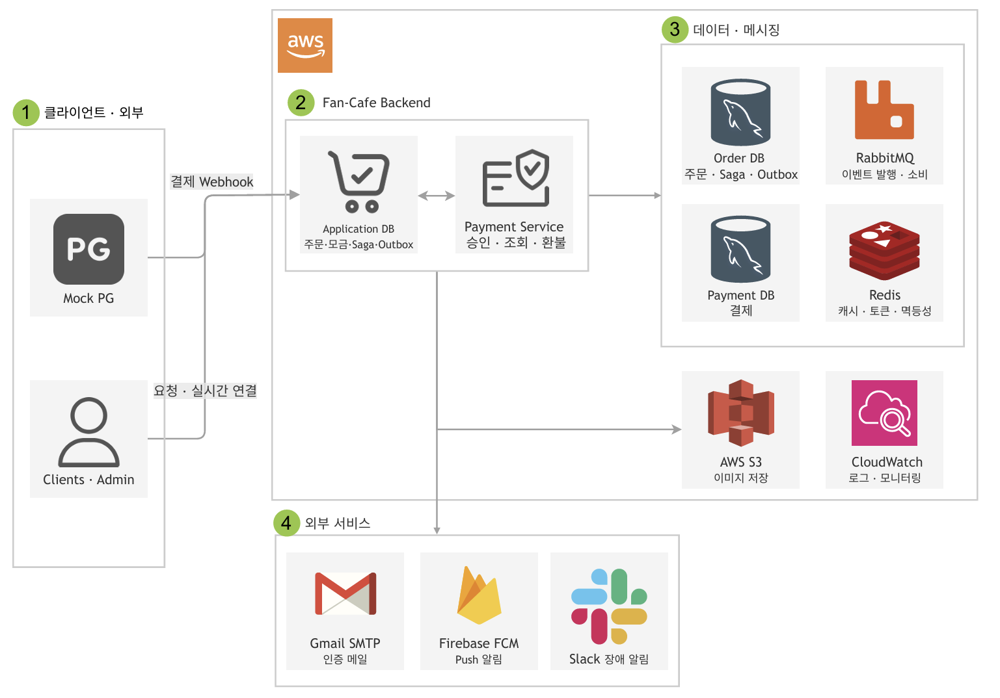
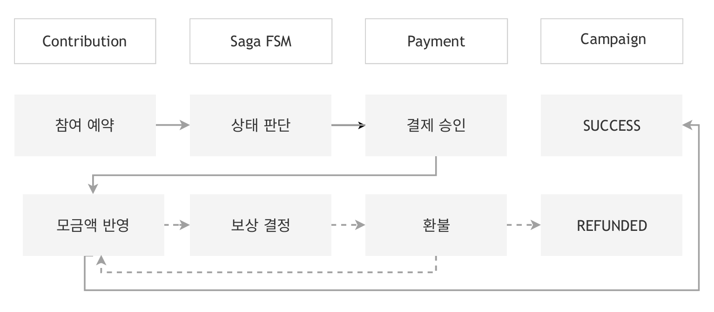
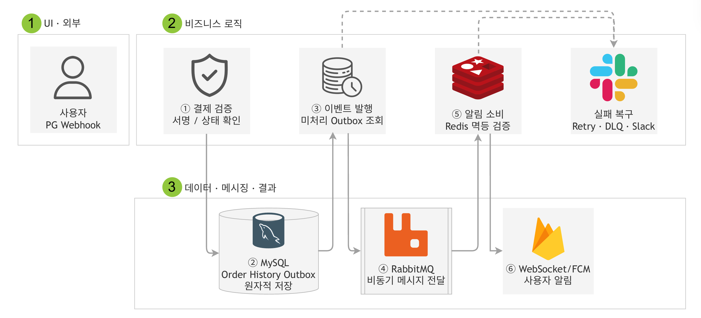

# Fan-Cafe

굿즈 주문과 팬 조공 모금을 처리하며, 결제 과정의 부분 실패와 이벤트 유실을 복구하는 Spring Boot 백엔드 프로젝트입니다. (개인 프로젝트)

## 시연 영상

결제 후 이벤트 실패를 Trace ID로 추적하고 Admin UI에서 복구하는 과정입니다. ([영상 보기](https://youtu.be/hIbWzBgVqBk))

---

## 기술 스택 및 아키텍처

### 기술 스택

| 구분 | 기술 / 버전 | 도입 목적 |
| --- | --- | --- |
| Language / Framework | Java 21, Spring Boot 3.5.13, Spring Data JPA, Spring Security | 도메인 로직, 트랜잭션, 인증 |
| Database / Cache | MySQL 8.0, Redis 7, QueryDSL 5.0.0 | 데이터 영속화, 멱등 처리, 조회 |
| Messaging | RabbitMQ 3, Spring AMQP | 비동기 이벤트 전달, 재시도, DLQ |
| Infra / Monitoring | Docker Compose, AWS S3, CloudWatch Logs, Actuator, Slack | 실행 환경, 파일 저장, 로그, 장애 감지 |
| Test / Tools | JUnit 5, Mockito, k6 | 단위 및 통합 테스트, 동시성, 복구 검증 |

### 전체 시스템 아키텍처

주문, 모금, 결제 처리와 MySQL, Redis, RabbitMQ, 외부 알림 서비스의 전체 연동 구조입니다.

<p align="center">
  
</p>

### Saga 기반 결제, 모금 정합성 처리 흐름

결제 승인 후 모금 반영, Campaign 성공, 목표 미달 환불까지 Saga가 현재 상태에 따라 정방향 처리와 보상을 결정합니다.

<p align="center">
  
</p>

### Transactional Outbox 기반 이벤트 처리 흐름

상태 변경과 Outbox 이벤트를 함께 저장하고, RabbitMQ를 통해 후속 이벤트를 전달하며 실패를 재시도와 격리 경로로 분리합니다.

<p align="center">
  
</p>

---

## 핵심 기술적 문제 해결

### 1. Saga FSM으로 결제 부분 실패 처리

**Problem:** Payment 승인 이후 후속 처리에 실패하면 서로 다른 서비스의 상태를 하나의 트랜잭션으로 되돌릴 수 없습니다. HTTP Timeout도 실제 결제 실패를 의미하지 않아 즉시 취소할 수 없습니다.

**Cause:** 결제 승인, 주문 완료, Contribution 반영, Campaign 상태 변경이 서로 다른 처리 단계에 있어 부분 실패 구간이 생깁니다.

**Fix:** Saga FSM이 현재 상태에 따라 정방향 처리와 보상을 결정합니다. 결제 결과가 불확실하면 `PAYMENT_UNKNOWN`으로 전이한 뒤 Payment 상태를 조회합니다. 승인된 결제를 주문에 반영할 수 없으면 `REFUND_PAYMENT` Outbox 명령으로 보상합니다. 마감 시 목표에 도달하지 못한 Campaign의 Contribution도 같은 보상 흐름으로 환불합니다.

**Result:** Timeout, 서버 종료, 늦은 승인, 주문 완료 실패, Campaign 마감 시나리오를 통합 테스트로 검증했습니다. 미완료 건은 Recovery Worker가 이어서 처리하고 자동 복구 한도를 넘으면 운영자 확인 대상으로 격리합니다.

<details>
<summary>관련 코드 및 파일 보기</summary>

- [`PaymentSagaOrchestrator.java`](src/main/java/com/example/fan_cafe/order/saga/application/PaymentSagaOrchestrator.java): 결제 결과와 Saga 상태를 대조해 정방향 처리, 상태 조회, 보상을 선택합니다.
- [`SagaCompensationService.java`](src/main/java/com/example/fan_cafe/order/saga/application/SagaCompensationService.java): 결제 환불과 Campaign Contribution 환불을 Saga 보상으로 시작합니다.

```java
try {
    payment = paymentClient.approve(orderId, expectedAmount, approvalAmount, paymentKey);
} catch (PaymentOutcomeUnknownException unknown) {
    SagaSnapshot current = sagaTransactionService.markPaymentUnknown(
            saga.sagaId(), summarizeUnknown(unknown));
    return continueAfterUnknown(current, orderId, unknown);
}
```

</details>

### 2. Outbox와 멱등 처리로 실행 보장

**Problem:** 상태 전이 이후 결제, 환불, 후속 이벤트 실행이 유실되거나 재시도로 중복 실행될 수 있습니다.

**Cause:** DB 상태 변경과 외부 메시지 전달은 하나의 원자적 트랜잭션으로 묶을 수 없습니다.

**Fix:** Saga 상태 전이와 `APPROVE_PAYMENT`, `REFUND_PAYMENT` 명령을 Outbox에 저장하고 Poller가 RabbitMQ로 전달합니다. Payment 서비스는 결제 키와 `REFUND:{sagaId}` 키로 반복 명령을 멱등 처리합니다. Campaign 목표 달성 시에는 Campaign 상태, Contribution 상태, `CAMPAIGN_SUCCEEDED` Outbox를 `SagaOrderCompletionService`의 같은 트랜잭션에서 저장합니다.

**Result:** 상태는 변경됐지만 실행 명령이 사라지는 구간을 제거했습니다. 반복 요청과 MQ 재전달에서도 결제와 환불이 중복 반영되지 않도록 구성했습니다.

<details>
<summary>관련 코드 및 파일 보기</summary>

- [`SagaOrderCompletionService.java`](src/main/java/com/example/fan_cafe/order/saga/application/SagaOrderCompletionService.java): 주문, Contribution, Campaign, Saga 변경을 하나의 트랜잭션으로 묶습니다.
- [`CampaignContributionPaymentService.java`](src/main/java/com/example/fan_cafe/campaign/application/CampaignContributionPaymentService.java): 목표 달성 시 Campaign 성공 상태와 사용자별 성공 Outbox를 저장합니다.

```java
if (campaign.isTargetReached()) {
    campaign.markSuccess(LocalDateTime.now(clock));
    contributionRepository.findDistinctUserIdsByCampaignIdAndStatus(
                    campaign.getId(), ContributionStatus.CONFIRMED)
            .forEach(userId -> campaignOutboxService.saveSuccess(
                    campaign.getId(), userId, campaign.getTitle()));
}
```

</details>

### 3. Recovery Worker로 미완료 Saga 복구

**Problem:** 결제 상태 조회, 주문 완료, 환불 도중 서버가 종료되면 Saga가 중간 상태에 남을 수 있습니다. 여러 Worker가 같은 Saga를 동시에 조회하면 잠금 경쟁과 중복 처리가 생길 수 있습니다.

**Cause:** 장애 이후 현재 상태부터 처리를 이어갈 복구 경로와 Worker 간 작업 분리가 필요합니다.

**Fix:** Recovery Worker가 `PAYMENT_PENDING`, `PAYMENT_UNKNOWN`, `PAYMENT_COMPLETED`, `COMPENSATING` 상태 중 `next_retry_at`이 지난 Saga를 다시 처리합니다. 실패 시 `retry_count`, `next_retry_at`, `last_error`를 갱신하고, 한도를 넘으면 `RECONCILIATION_REQUIRED`로 전이해 Slack 알림 Outbox를 저장합니다. 다중 Worker는 `READ_COMMITTED`의 짧은 claim 트랜잭션과 `FOR UPDATE SKIP LOCKED`로 작업을 분리합니다.

**Result:** 4,000개의 미완료 Saga를 대상으로 Worker 수를 변경하며 처리량과 DB Lock 경쟁을 비교했고, 다중 Worker 환경에서도 중복 처리 없이 복구되는지 검증했습니다.

<details>
<summary>관련 코드 및 파일 보기</summary>

- [`SagaRecoveryTransactionService.java`](src/main/java/com/example/fan_cafe/order/saga/recovery/SagaRecoveryTransactionService.java): 복구 대상을 claim하고 재시도 또는 운영자 확인 상태를 기록합니다.
- [`SagaInstanceRepository.java`](src/main/java/com/example/fan_cafe/order/saga/infrastructure/SagaInstanceRepository.java): 처리 시각이 지난 미완료 Saga를 잠금 대기 없이 한 건씩 조회합니다.

```sql
SELECT *
FROM saga_instance
WHERE status IN ('PAYMENT_PENDING', 'PAYMENT_UNKNOWN', 'PAYMENT_COMPLETED', 'COMPENSATING')
  AND next_retry_at <= :now
ORDER BY next_retry_at, saga_id
LIMIT 1
FOR UPDATE SKIP LOCKED
```

</details>

---

## 실행 및 테스트

### Docker Compose 실행

```bash
docker compose up -d --build
```

### API 문서

```text
http://localhost:{SERVER_PORT}/swagger-ui/index.html
```

### Saga Recovery 4,000건 동시성 실험

4,000개의 미완료 Saga를 대상으로 Worker 수를 `1`, `2`, `4`, `8`, `10`으로 바꾸며 처리량과 DB Lock 경쟁을 비교합니다.

<details>
<summary>실험 재현 방법 보기</summary>

전체 절차와 전제 조건은 [`docs/experiments/saga-step8/README.md`](docs/experiments/saga-step8/README.md)에 있습니다.

인프라를 시작하고 각 실행 전에 데이터를 초기화합니다.

```powershell
docker compose -f docker-compose.yml -f docker-compose.experiment.yml up -d db payment-db redis rabbitmq
docker compose stop app payment-service

Get-Content -Raw docs/experiments/saga-step8/experiment2-reset-order.sql |
  docker compose exec -T db sh -lc 'mysql -uroot -p"$MYSQL_ROOT_PASSWORD" fan_cafe'
Get-Content -Raw docs/experiments/saga-step8/experiment2-reset-payment.sql |
  docker compose exec -T payment-db sh -lc 'mysql -uroot -p"$MYSQL_ROOT_PASSWORD" payment_db'
Get-Content -Raw docs/experiments/saga-step8/experiment2-seed-order.sql |
  docker compose exec -T db sh -lc 'mysql -uroot -p"$MYSQL_ROOT_PASSWORD" fan_cafe'
Get-Content -Raw docs/experiments/saga-step8/experiment2-seed-payment.sql |
  docker compose exec -T payment-db sh -lc 'mysql -uroot -p"$MYSQL_ROOT_PASSWORD" payment_db'
```

실행별 `runId`를 지정하고 BEFORE snapshot을 저장한 뒤 Worker를 시작합니다.

```powershell
$env:EXPERIMENT_PAYMENT_PARTIAL_SUCCESS_ENABLED = "false"
docker compose -f docker-compose.yml -f docker-compose.experiment.yml up -d payment-service

$runId = "concurrency-1-run-1"
$env:SAGA_RECOVERY_EXPERIMENT_RUN_ID = $runId
$beforeSql = "SET @run_id='$runId'; SET @snapshot_phase='BEFORE';`n" +
  (Get-Content -Raw docs/experiments/saga-step8/mysql-lock-snapshot.sql)
$beforeSql | docker compose exec -T db sh -lc 'mysql -uroot -p"$MYSQL_ROOT_PASSWORD" fan_cafe'

$env:SAGA_RECOVERY_CONCURRENCY = "1"
docker compose -f docker-compose.yml -f docker-compose.experiment.yml up -d app
```

4,000건이 처리된 직후 AFTER snapshot과 결과를 조회합니다.

```powershell
$afterSql = "SET @run_id='$runId'; SET @snapshot_phase='AFTER';`n" +
  (Get-Content -Raw docs/experiments/saga-step8/mysql-lock-snapshot.sql)
$afterSql | docker compose exec -T db sh -lc 'mysql -uroot -p"$MYSQL_ROOT_PASSWORD" fan_cafe'

$resultSql = "SET @run_id='$runId';`n" +
  (Get-Content -Raw docs/experiments/saga-step8/experiment2-result.sql)
$resultSql | docker compose exec -T db sh -lc 'mysql -uroot -p"$MYSQL_ROOT_PASSWORD" fan_cafe'
```

결과 SQL은 처리 Saga 수, 순수 Recovery 처리시간, 초당 처리량, InnoDB row lock waits와 row lock wait time의 BEFORE/AFTER 차이를 출력합니다.

</details>

### Payment Partial Success 20,000건 실험

승인 커밋 후 응답 지연을 주입해 `PAYMENT_UNKNOWN` 복구와 최종 수렴을 검증합니다.

<details>
<summary>실험 재현 방법 보기</summary>

초기화와 결과 조회 명령은 [`docs/experiments/saga-step8/README.md`](docs/experiments/saga-step8/README.md)에 있습니다.

```powershell
$env:EXPERIMENT_PAYMENT_PARTIAL_SUCCESS_ENABLED = "true"
$env:EXPERIMENT_PAYMENT_PARTIAL_SUCCESS_PERCENT = "20"
$env:EXPERIMENT_PAYMENT_APPROVAL_RESPONSE_DELAY = "5s"
$env:SAGA_RECOVERY_CONCURRENCY = "1"
docker compose -f docker-compose.yml -f docker-compose.experiment.yml up -d payment-service app

k6 run -e VUS=50 -e BASE_URL=http://localhost:8080 k6/saga-partial-success.js
```

</details>

### Transactional Outbox 부하 테스트

100,000건 Outbox 부하 테스트는 복합 인덱스와 `FOR UPDATE SKIP LOCKED` 적용 전후의 Poller 조회 성능을 비교합니다. 기록된 측정에서 조회 p95는 3초에서 70.04ms로 감소했습니다.

<details>
<summary>실험 재현 방법 보기</summary>

```bash
mysql -u root -p fan_cafe < scripts/seed-payment-pending-orders.sql
k6 run -e BASE_URL=http://localhost:8080 -e MOCK_PG_WEBHOOK_SECRET=<MOCK_PG_WEBHOOK_SECRET> k6/order-webhook-outbox-load-test.js
```

</details>
